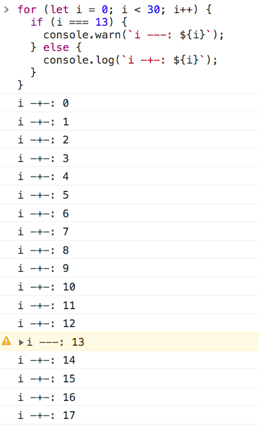

# 6 種不可不知的「console.log」進階應用

相信 console.log 是 Frontend 開發人員的好朋友，我們用它印出各種輔助資訊來協助我們解決問題。

這邊文章會跟你分享 6 種 console.log 的進階應用，並說明各自的使用情境，讓你在開發的路上更加順利。

> 大家可以在瀏覽器按下「F12」，於 Console 的分頁貼上文中的程式碼來驗證喔！

### ㄧ、在 console.log 加入 {}，讓資訊顯示的更友善

如果想要將變數的內容印出來，我們通常會這麼做：

```js
const name = "Dean";
const book = "給全端工程師的職涯生存筆記";

console.log(name, book);
```


但這種作法在變數很多的時候，你就會搞不清楚各自對應的關係了，比如：

```js
const name = "Dean";
const book = "給全端工程師的職涯生存筆記";
const skill = "Full-Stack";
const type = "Career";

console.log(name, book, skill, type);
```


有沒有覺得上面的資訊閱讀起來很不友善？其實我們只要在 console.log 中，**把這些變數用 {} 包起來**，它就會以物件的類型來顯示嚕！

```js
const name = "Dean";
const book = "給全端工程師的職涯生存筆記";
const skill = "Full-Stack";
const type = "Career";

console.log({ name, book, skill, type });
```


### 二、原來 console.log 竟然可以使用 CSS Style !

如果你在 Facebook 的頁面按下「F12」，於 Console 的分頁中應該會看到如下警告：


當時我就很好奇這種特殊的 Style 是怎麼呈現的，後來發現只要在前面加上「%c」就可以了：

```js
const text = "大寶寶";
const style = "color: blue;font-size:40px";

console.log(`使用 CSS Style %c${text}`, style);
```


### 三、console.log 寫太多找不到重點？你該試試看 console.warn()！

遇到 Bug 時，我們常常需要沿著線索下 console.log 找問題，但如果 console.log 寫太多，我們會無法找到哪個才是我們需要的資訊，下面就舉一個極端點的例子：

```js
for (let i = 0; i < 30; i++) {
  if (i === 13) {
    console.log(`i ---: ${i}`);
  } else {
    console.log(`i -+-: ${i}`);
  }
}
```


我相信大多數人第一眼是不會發現「i === 13」時印出的東西不同，但如果透過 console.warn() 來輔助就會一目瞭然：

```js
for (let i = 0; i < 30; i++) {
  if (i === 13) {
    console.warn(`i ---: ${i}`);
  } else {
    console.log(`i -+-: ${i}`);
  }
}
```



### 四、錯誤訊息請用 console.error()，不要用 console.log() 來整自己

筆者發現有些工程師在 try...catch 的撰寫上，是用 console.log() 來印錯誤訊息的 😅

這會導致錯誤訊息被其他 console.log() 的訊息淹沒，運氣不好就是系統出包後才發現，因此建議乖乖使用 console.error() 來印錯誤訊息，這樣自己比較方便 Debug。

```js
try {
  // 直接拋錯誤訊息讓 catch 來接
  throw "Something went wrong.";
} catch (err) {
  console.error(err);
}
```


### 五、用 console.time() 追蹤程式執行時間，找出效能瓶頸

有時我們發現某些頁面跑的特別慢，為了確定問題到底出哪裡，「console.time() & console.timeEnd()」就是一個很好的方案：

```js
console.time();

setTimeout(function () {
  console.timeEnd();
}, 2000);
```


但一個功能裡面可能用到多個 api，當你想釐清到底是哪個 api 效率有問題時，就可以給 console.time() 加上標記(flag)。

```js
console.time("api-1");

setTimeout(function () {
  console.timeEnd("api-1");
}, 2000);

console.time("api-2");

setTimeout(function () {
  console.timeEnd("api-2");
}, 1000);
```


### 六、用 console.table() 將資訊轉成表格來閱讀

Backend 很常回傳 Table 格式的資訊，如果我們使用 console.log() 直接將結果印出來，在需要比對資料的時候會不好閱讀：

```js
const users = [
  {
    name: "Dean",
    email: "dean_lin@test.com",
    department: "Cloud",
    job_title: "Manager",
    age: 33,
    hire_date: "2016-06-06",
  },
  {
    name: "Ray",
    email: "ray_chen@test.com",
    department: "Cloud",
    job_title: "Engineer",
    age: 31,
    hire_date: "2019-06-06",
  },
  {
    name: "Davy",
    email: "davy_chang@test.com",
    department: "Cloud",
    job_title: "Designer",
    age: 35,
    hire_date: "2017-06-06",
  },
];

console.table(users);
```


在上圖中，我們可以看到如果想要知道個別 user 的詳細資訊，需要自己手動展開 object，不過如果我們將最後的 `console.log(users);` 改寫成 `console.table(users);`，資料就會像下圖一樣變成表格很好閱讀嚕！


**參考資源**：[It’s 2022, Please Don’t Just Use “console.log” Anymore](https://javascript.plainenglish.io/its-2022-please-don-t-just-use-console-log-anymore-217638337c7d)