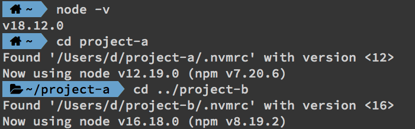

# 使用 nvm + zsh script 讓 Node.js 版本在不同的專案間自動切換（Automatically switch to correct version of Node.js based on project）

Node.js 版本更新速度極快，但未必所有套件都能相容於新的版本，這造成每個專案的 Node.js 版本不盡相同；即使 nvm 可以幫我們快速切換 Node.js 版本，但在實務開發上還是不太方便，所以今天要介紹如何調整 zsh script 讓你在專案間自動切換 Node.js 版本。

> 筆者原本選用「avn」這個套件，但它真的已經年久失修了無法使用[連結](https://github.com/wbyoung/avn/issues/109#issuecomment-945155272)

### STEP 1：建立兩個 Node.js 專案

在終端機複製貼上下方指令即可。

```
mkdir project-a
cd project-a
npm init -y
cd ..

mkdir project-b
cd project-b
npm init -y
cd ..
```

### STEP 2：安裝特定的 Node.js 版本以供測試

尚未 nvm 安裝的讀者，可以先透過如下指令安裝，更新的版本請參考[連結](https://github.com/nvm-sh/nvm#installing-and-updating)。
```
curl -o- https://raw.githubusercontent.com/nvm-sh/nvm/v0.39.2/install.sh | bash
```

安裝完後建議重開終端機讓它生效(依照建議貼上命令也可)，接著透過它安裝 Node.js 特定版本：
```
nvm install 12

nvm install 16
```

### STEP 3：在兩個 Node.js 專案中加入「.nvmrc」並指定 Node.js 版本

接下來我們就分別在兩個專案中新增「.nvmrc」的檔案，並個別指定 12、16 版本方便測試。

```
cd project-a
touch .nvmrc
echo "12" >> .nvmrc
cd ..

cd project-b
touch .nvmrc
echo "16" >> .nvmrc
cd ..
```

### STEP 4：調整 zsh script

只要專案資料夾的根目錄有「.nvmrc」的檔案，下面的 script 會自動呼叫「nvm use」進行切換；唯一要注意的是，記得把 script 放在 nvm 初始化後的位置才會生效（或是直接放在最後面也可以）。

在終端機輸入 `vi ~/.zshrc`，編輯自己的「.zshrc」檔案（每個人的路徑可能不同）。

```
# place this after nvm initialization!
autoload -U add-zsh-hook
load-nvmrc() {
  local node_version="$(nvm version)"
  local nvmrc_path="$(nvm_find_nvmrc)"

  if [ -n "$nvmrc_path" ]; then
    local nvmrc_node_version=$(nvm version "$(cat "${nvmrc_path}")")

    if [ "$nvmrc_node_version" = "N/A" ]; then
      nvm install
    elif [ "$nvmrc_node_version" != "$node_version" ]; then
      nvm use
    fi
  elif [ "$node_version" != "$(nvm version default)" ]; then
    echo "Reverting to nvm default version"
    nvm use default
  fi
}
add-zsh-hook chpwd load-nvmrc
load-nvmrc
```

完成後再於終端機輸入 `source ~/.zshrc` 讓 script 生效。

> 這個方案是參考[stackoverflow](https://stackoverflow.com/a/57779249)的解答。

### STEP 5：實測是否有效

筆者在開頭故意切換到 Node.js 18 的版本，然後再依序切換到「project-a」以及「project-b」的資料夾，從下圖大家可以看到 Node.js 的版本都順利切換嚕！



> 希望今天這篇文章，有幫大家免於不同專案的版本切換之苦～