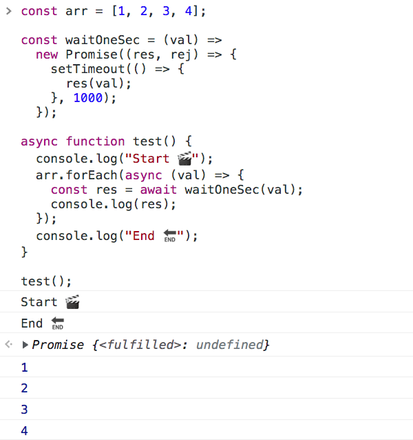
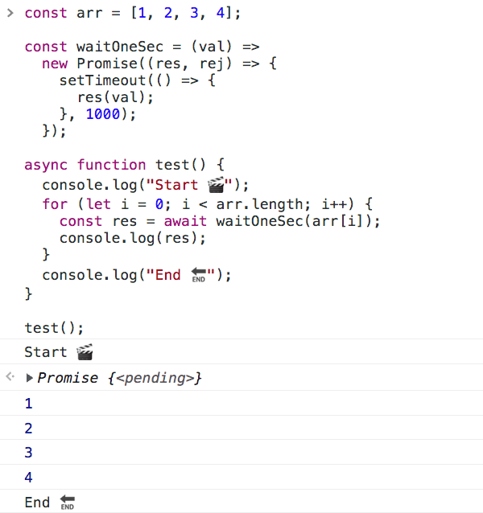
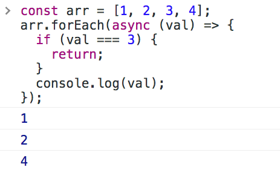
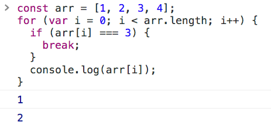

# forEach 跟 for 有什麼差異？ ── 感覺很像但又不太一樣的迴圈

在認識 forEach、map 這類高階函數後，就比較少使用 for 迴圈了，畢竟前者寫起來更加簡潔。。

但不久前有朋友遇到 Bug 跑來問我，說他程式的執行順序怪怪的，明明有寫 await，但跑起來卻不符期待；在看過程式後，我發現問題出在「forEach」這個函數。

### ▋ 別在 forEach 裡面使用 await

朋友想透過 forEach 去遍歷陣列，並希望在遍歷完畢後去做其他事情。我將他的程式結構縮減如下：

```js
const arr = [1, 2, 3, 4];

const waitOneSec = (val) =>
  new Promise((res, rej) => {
    setTimeout(() => {
      res(val);
    }, 1000);
  });

async function test() {
  console.log("Start 🎬");
  arr.forEach(async (val) => {
    const res = await waitOneSec(val);
    console.log(res);
  });
  console.log("End 🔚");
}

test();
```

儘管在 forEach 裡面用了 await，但實際執行的結果卻不是直覺想的那樣；從下圖可以看到，在 forEcah 的 await 跑完前，「End 🔚」就先印出來了：



> 會出現這樣的結果，`是因為 forEach 本身不是 Promise`，forEach 只是將陣列的內容抽出來放入 callback function；假如你把 forEach 改成 map 也會遇到相同的問題。

了解問題的成因後，我們可以採取最暴力簡單的方案，那就是改用 for 迴圈處理：

```js
const arr = [1, 2, 3, 4];

const waitOneSec = (val) =>
  new Promise((res, rej) => {
    setTimeout(() => {
      res(val);
    }, 1000);
  });

async function test() {
  console.log("Start 🎬");
  for (let i = 0; i < arr.length; i++) {
    const res = await waitOneSec(arr[i]);
    console.log(res);
  }
  console.log("End 🔚");
}

test();
```


> 備註：有些人會自己寫一個函式（ex：asyncForEach），用 forEach 的寫法來跑 await；這也是一個解法，但兩者運行的觀念要搞清楚避免混淆，[參考連結](https://israynotarray.com/javascript/20211029/2739130728/)。

### ▋ 疑！原來無法中斷 forEach 迴圈！

解決上面的問題後，筆者開始好奇 forEach 跟 for 迴圈還有什麼差異。

然後發現 `return` 這種中斷執行的設計，在 forEach 的運作也跟原本的預料的不同！

```js
const arr = [1, 2, 3, 4];
arr.forEach(async (val) => {
  if (val === 3) {
    return;
  }
  console.log(val);
});
```

在下圖中可以看到，就算我們設定在 3 的時候要 return，他還是會遍歷完整個陣列：



但同樣的程式我們改成 for 迴圈，透過 break 就能結束迴圈的執行：

```js
const arr = [1, 2, 3, 4];
for (var i = 0; i < arr.length; i++) {
  if (arr[i] === 3) {
    break;
  }
  console.log(arr[i]);
}
```



> 今天這篇文章應該算是冷知識分享🤣也順便幫自己做個紀錄，希望幫助到剛好遇到類似問題的朋友們😃
