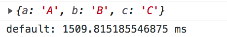
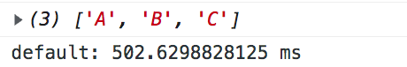
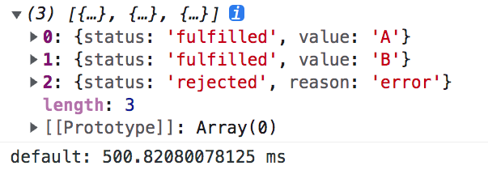

# JavaScript 如何讓 await 函式並行（同場說明 Promise.all 和 Promise.allSettled 的區別）

> 大家可以在瀏覽器按下「F12」，於 Console 的分頁貼上文中的程式碼來驗證喔！

撰寫前端時，除非需求剛好都是靠一支 API 就能取得完整資料，否則許多頁面都是需要 call 多個 API，再經過一些處理後才能渲染出完整的畫面。

為了等待資料回傳，我們通常都會搭配 await，但有時我們 API 之間並沒有依序執行的需求（下一隻 API 並不需要使用上一隻 API 回傳的結果作為參數）；在這樣的情境下，假使有個需求要 call 5 支甚至更多的 API，如果還是採取依序執行的方案，就會浪費使用者許多時間。下面筆者就先舉一個直觀的範例：

```js
const waitFor = delay => new Promise(resolve => setTimeout(resolve, delay));
async function api1 () {
    await waitFor(500);
    return "A";
}
async function api2 () {
    await waitFor(500);
    return "B";
}
async function api3 () {
    await waitFor(500);
    return "C";
}
async function callMutiApi () {
    console.time();
    const a = await api1()
    const b = await api2()
    const c = await api3()
    console.log({ a, b, c });
    console.timeEnd();
}
callMutiApi();
```



在上圖中，我們可以看到總執行時長為 1512 ms，有許多時間被浪費在等待上一支 API 完成。

### ▋採用 Promise.all 來解決問題

既然 API 之間沒有依序執行的需求，我們就可以將其改寫為 `Promise.all`，透過並行（parallel）來提升效率：

```js
const waitFor = delay => new Promise(resolve => setTimeout(resolve, delay));
async function api1 () {
    await waitFor(500);
    return "A";
}
async function api2 () {
    await waitFor(500);
    return "B";
}
async function api3 () {
    await waitFor(500);
    return "C";
}
async function callMutiApi () {
    console.time();
    const promises = [
        api1(),
        api2(),
        api3(),
    ];
    Promise.all(promises).then(values => {
        console.log(values);
        console.timeEnd();
    });
}
callMutiApi();
```



經過改寫，我們可以從輸出的結果中看到，總執行時長從 `1512 ms` 下降到 `502 ms`，這是對使用者來說非常有感的提升。

### ▋Promise.all 會碰到什麼問題？

儘管透過 `Promise.all` 已經提升了不少效率，但這個方案在遇到其中一支 API 吐出 error 時，情況就會變得很麻煩。

```js
const waitFor = delay => new Promise(resolve => setTimeout(resolve, delay));
async function api1 () {
    await waitFor(500);
    return "A";
}
async function api2 () {
    await waitFor(500);
    return "B";
}
async function api3 () {
    await waitFor(500);
    throw "error"; // 丟出錯誤訊息
}
async function callMutiApi () {
    console.time();
    const promises = [
        api1(),
        api2(),
        api3(),
    ];
    Promise.all(promises)
        .then(values => console.log(values))
        .catch(err => console.log(err))
        .finally(() => console.timeEnd())
}
callMutiApi();
```

如果執行上面的程式，你會發現透過 catch 我們成功抓到了 "error" 的錯誤訊息，但其他執行成功的訊息全部都消失了。

有時這種「只有成功 or 失敗」的結果的確是我們要的，但在實務上，我們未必需要所有 API 都執行成功，面對錯誤可能有設計另一套處理方案。

### ▋導入 Promise.allSettled 解決問題

為了取得所有回傳結果，我們可以改為使用 `Promise.allSettled`，在輸出的時候，它會多出一個 `status` 的參數來說明執行結果的成功 or 失敗。

```js
const waitFor = delay => new Promise(resolve => setTimeout(resolve, delay));
async function api1 () {
    await waitFor(500);
    return "A";
}
async function api2 () {
    await waitFor(500);
    return "B";
}
async function api3 () {
    await waitFor(500);
    throw "error"; // 丟出錯誤訊息
}
async function callMutiApi () {
    console.time();
    const promises = [
        api1(),
        api2(),
        api3(),
    ];
    Promise.allSettled(promises).then(values => {
        console.log(values);
        console.timeEnd();
    });
}
callMutiApi();
```



從上圖我們可以看到，無論執行的結果是成功或失敗，我們都能取得那些執行成功後的訊息。

> **備註：**
> Node.js 從 v12.9.0 開始支援 Promise.allSettled 的語法，大多數的瀏覽器也在 2019 年後支援；針對少數不支援的環境，你可以透過 npm 套件自行擴充，如：[promise.allsettled](https://www.npmjs.com/package/promise.allsettled)

### ▋總結

1. 如果 API 沒有依序執行的需求，透過 Promise.all 的並行，可以增加執行的效率。
2. 為了解決 Promise.all 失敗後，成功訊息一併消失的問題，可以改用 Promise.allSettled 來取得所有回傳結果。